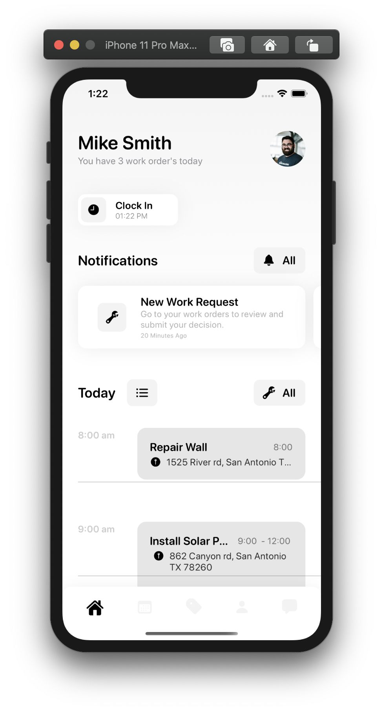
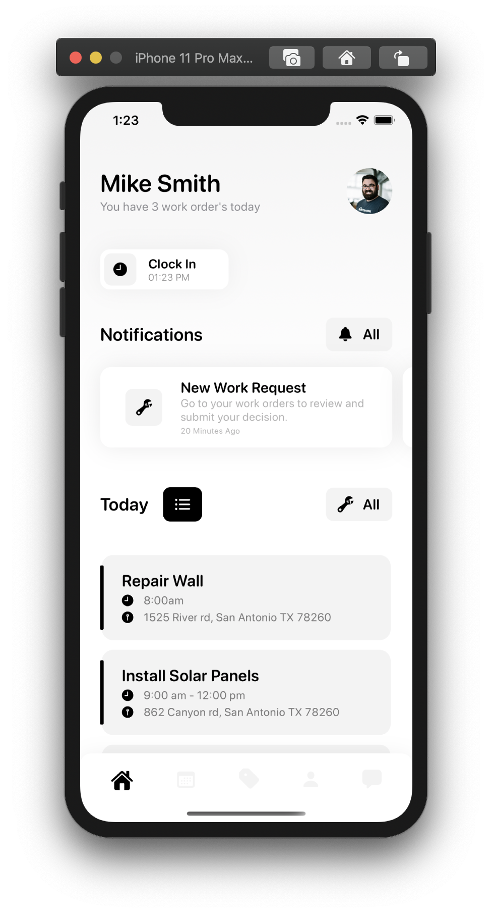
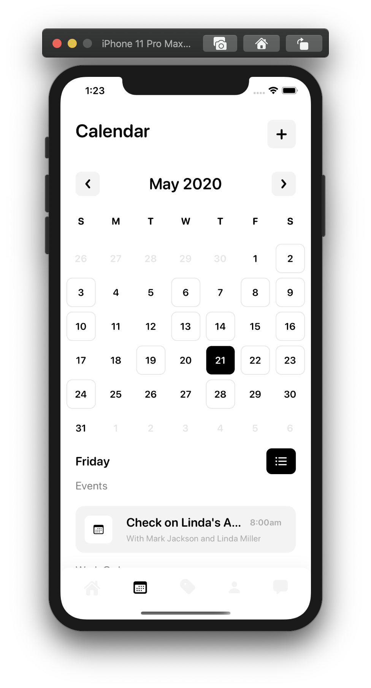
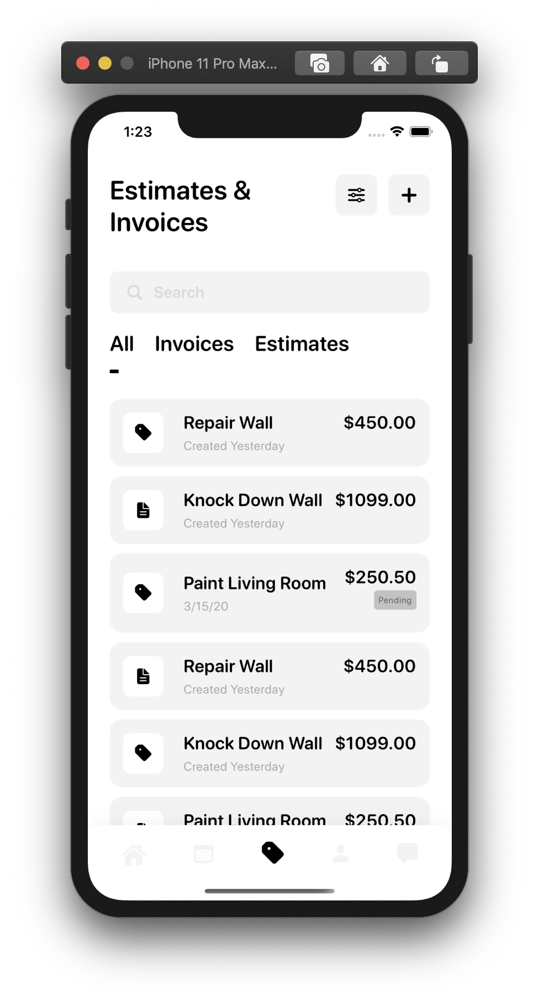

# Contractor Management Application

Contractor management application built with [SwiftUI](https://developer.apple.com/xcode/swiftui/) and designed in Figma. Allows contractors to manage jobs, events, invoices, estimates, and clock-in/out times. Contractors are able to see their daily agenda on the home page or calendar page via timeline or list.

    
    

    
    

